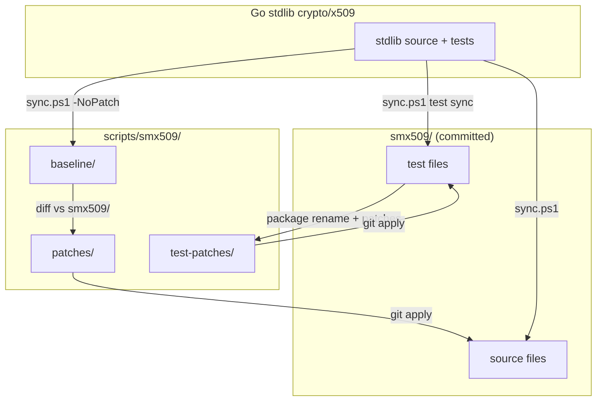
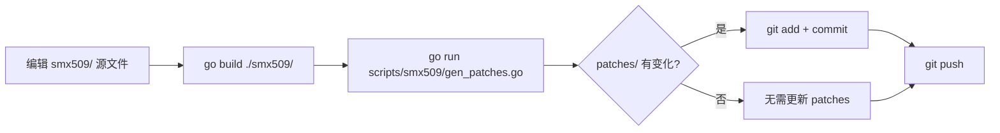
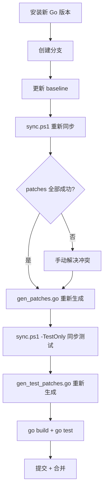
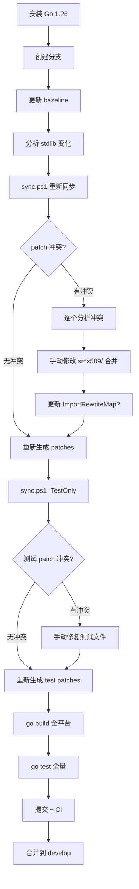
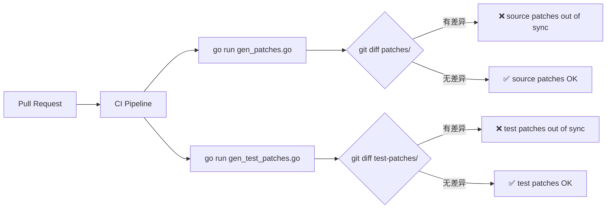

# smx509 Maintenance Toolkit

smx509 是 Go stdlib `crypto/x509` 的 clean fork，通过**声明式 patch** 描述与上游的偏差。本目录包含维护 smx509 所需的全部工具和数据。

## 目录结构

```
scripts/smx509/
├── baseline/                    # Go stdlib 基线快照（.go.txt，已提交到 git）
│   ├── x509.go.txt
│   ├── parser.go.txt
│   └── ... (19 files)
│
├── patches/                     # 源码补丁（5 个，gen_patches.go 自动生成）
│   ├── 001-root-platform.patch    # 平台 root 桩替换（darwin/linux）
│   ├── 010-sm2-pqc-core.patch     # SM2 + PQC 核心集成
│   ├── 020-pkcs-keys.patch        # PKCS#8 国密密钥编码
│   ├── 030-sm4-pem.patch          # SM4 PEM 加密
│   └── 100-extensions.patch       # 扩展文件（cfca_csr.go 等新文件）
│
├── test-patches/                # 测试补丁（2 个，gen_test_patches.go 自动生成）
│   ├── 010-testenv-stub.patch     # internal/testenv 替代桩
│   └── 020-envvars-abs-path.patch # TestEnvVars SSL_CERT_FILE 绝对路径修复
│
├── gen_patches.go               # 源码补丁生成器
├── gen_test_patches.go          # 测试补丁生成器
└── sync.ps1                     # 同步脚本（stdlib → smx509/）
```

## 核心概念



**patch = smx509/ 与 baseline/ 的 diff**。任何时候运行 `gen_patches.go`，输出应与 `patches/` 目录一致（CI 自动检查）。

---

## 工作流 1：直接修改 smx509 文件

**场景**：修复 bug、添加国密/PQC 功能、修改扩展文件等，不涉及 Go 版本升级。



### 步骤

```bash
# 1. 直接编辑 smx509/ 中的文件
vim smx509/x509.go

# 2. 验证编译
go build ./smx509/

# 3. 重新生成补丁（如果修改了被 patch 覆盖的文件）
go run scripts/smx509/gen_patches.go

# 4. 检查 diff，确认补丁变化符合预期
git diff scripts/smx509/patches/

# 5. 提交
git add -A
git commit -m "fix(smx509): ..."
```

### 注意事项

- 如果修改的是**扩展文件**（`cfca_csr.go`, `csr_rsp.go`, `explicit_curves.go`, `verify_digest.go`），`100-extensions.patch` 会自动更新
- 如果修改的是**测试文件**，还需运行 `go run scripts/smx509/gen_test_patches.go`
- CI 会自动检查 patches 一致性

---

## 工作流 2：Go 小版本更新（1.25.4 → 1.25.11）

**场景**：Go 发布了同一大版本的安全补丁/bug 修复，`crypto/x509` 可能有微小变化。



### 步骤

```bash
# 1. 安装新 Go 版本
go install golang.org/dl/go1.25.11@latest
go1.25.11 download

# 2. 创建升级分支
git checkout -b upgrade-smx509-go1.25.11

# 3. 用新版本更新 baseline
powershell -File scripts/smx509/sync.ps1 `
    -GoRoot "$(go1.25.11 env GOROOT)" `
    -TargetDir scripts/smx509/baseline `
    -NoPatch

# 4. 检查 baseline 变化
git diff scripts/smx509/baseline/

# 5. 重新同步 smx509/（源文件 + 测试文件）
powershell -File scripts/smx509/sync.ps1 `
    -GoRoot "$(go1.25.11 env GOROOT)"

# 6. 重新生成所有补丁
go run scripts/smx509/gen_patches.go
go run scripts/smx509/gen_test_patches.go

# 7. 验证
go build ./smx509/
go test ./smx509/...

# 8. 提交
git add -A
git commit -m "chore(smx509): update baseline to Go 1.25.11"
```

### 关键点

- **baseline 是版本化的** — 提交到 git，CI 不依赖 runner 的 Go 小版本
- 小版本更新通常**无冲突**，patches 可直接重新应用
- 如果 `crypto/x509` 没变化，baseline diff 为空，无需任何操作

---

## 工作流 3：Go 大版本更新（1.25.x → 1.26.x）

**场景**：Go 发布新大版本，`crypto/x509` 可能有较大重构，patches 可能冲突。



### 步骤

```bash
# === 阶段 1: 准备 ===
go install golang.org/dl/go1.26.0@latest
go1.26.0 download
git checkout -b upgrade-smx509-go1.26

# === 阶段 2: 分析变化 ===
# 比较新 stdlib 与当前 baseline
powershell -File scripts/smx509/sync.ps1 `
    -GoRoot "$(go1.26.0 env GOROOT)" `
    -TargetDir scripts/smx509/baseline -NoPatch
git diff --stat scripts/smx509/baseline/

# === 阶段 3: 同步并解决冲突 ===
powershell -File scripts/smx509/sync.ps1 `
    -GoRoot "$(go1.26.0 env GOROOT)"

# 如果 patch 失败，用 -DryRun 预检：
powershell -File scripts/smx509/sync.ps1 `
    -GoRoot "$(go1.26.0 env GOROOT)" -DryRun

# 手动解决冲突后，重新生成：
go run scripts/smx509/gen_patches.go

# === 阶段 4: 测试文件同步 ===
powershell -File scripts/smx509/sync.ps1 `
    -GoRoot "$(go1.26.0 env GOROOT)" -TestOnly

# 如果测试 patch 冲突，手动修复后重新生成：
go run scripts/smx509/gen_test_patches.go

# === 阶段 5: 全平台验证 ===
go build ./...
GOOS=linux go build ./...
GOOS=darwin go build ./...
GOOS=darwin GOARCH=arm64 go build ./...

go test ./smx509/...
go test ./pkcs7/... ./cfca/... ./pkcs8/...
go test ./...

# === 阶段 6: 合并 ===
git add -A
git commit -m "feat(smx509): upgrade to Go 1.26 stdlib baseline"
git checkout develop
git merge --no-ff upgrade-smx509-go1.26
```

### 冲突解决指南

| 冲突类型 | 说明 | 处理方式 |
|---------|------|---------|
| **Context shift** | 周围代码移动，逻辑未变 | 重新生成 patch 即可 |
| **Semantic overlap** | stdlib 改了我们 patch 的同一区域 | 手动合并：保留 SM2/PQC 逻辑 + 采纳 stdlib 变更 |
| **New API** | stdlib 新增函数/类型 | 通常无冲突，可能需扩展 patch |
| **Refactoring** | stdlib 重构了代码结构 | 需要大幅重写 patch |
| **New internal import** | stdlib 新增 `internal/*` 导入 | 在 `sync.ps1` 的 `ImportRewriteMap` 中添加映射 |

### SM2/PQC/SM4 不变量清单

解决冲突时，以下逻辑**必须保留**：

- `oidSignatureSM2WithSM3`, `oidPublicKeySM2` — SM2 OID 常量
- `SM2WithSM3` SignatureAlgorithm — `signatureAlgorithmDetails` 条目 + `checkSignature` SM2 分支
- `MLDSA44/65/87`, `SLHDSASHA2*` — PQC 算法（同 SM2 模式）
- `PEMCipherSM4` — SM4-CBC 在 `rfc1423Algos`
- `ParsePKCS8PrivateKey` / `MarshalPKCS8PrivateKey` — SM2/ML-DSA/SLH-DSA 分支
- `CheckSignatureWithDigest` — SHA1 拒绝逻辑（与 `checkSignature` 对齐）
- `ImportRewriteMap` — `internal/godebug` → `github.com/emmansun/gmsm/internal/godebug`

---

## CI 自动检查



CI 会在每次 PR 时验证 patches 一致性。如果失败，按提示在本地运行对应命令并提交结果。

---

## 快速参考

| 操作 | 命令 |
|------|------|
| 重新生成源码补丁 | `go run scripts/smx509/gen_patches.go` |
| 重新生成测试补丁 | `go run scripts/smx509/gen_test_patches.go` |
| 同步源文件 + 测试 | `powershell -File scripts/smx509/sync.ps1` |
| 仅同步测试文件 | `powershell -File scripts/smx509/sync.ps1 -TestOnly` |
| 更新 baseline | `powershell -File scripts/smx509/sync.ps1 -TargetDir scripts/smx509/baseline -NoPatch` |
| 预检 patch 应用 | `powershell -File scripts/smx509/sync.ps1 -DryRun` |

> ⚠️ **DryRun 警告**：`-DryRun` 只控制 patch 应用的 `--check` 模式，**不会阻止文件复制**。源文件仍会被 stdlib 版本覆盖。
